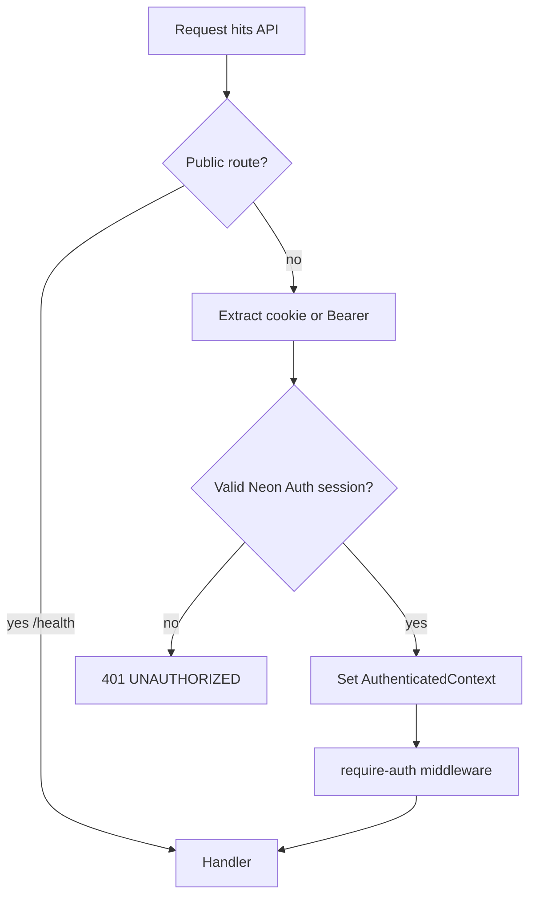
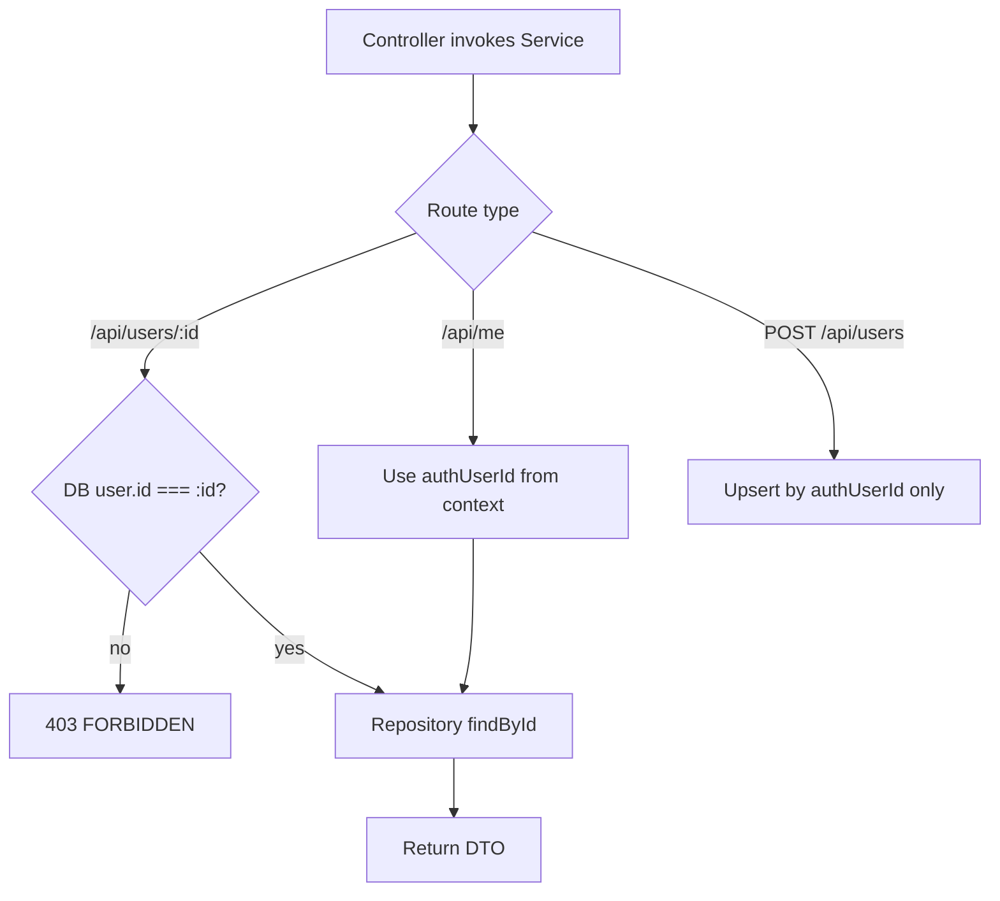

# API Application — API Design

## Base URL

| Environment | Base |
|-------------|------|
| Local dev | `http://localhost:3001` |
| Production | `https://api.<domain>` or `https://<domain>` with reverse proxy |

All JSON endpoints use `Content-Type: application/json` unless noted.

## Error envelope (all routes)

```json
{
  "error": {
    "code": "UNAUTHORIZED",
    "message": "Session is invalid or expired",
    "requestId": "550e8400-e29b-41d4-a716-446655440000"
  }
}
```

| HTTP | Code examples |
|------|----------------|
| 400 | `VALIDATION_ERROR` |
| 401 | `UNAUTHORIZED` |
| 403 | `FORBIDDEN` |
| 404 | `NOT_FOUND` |
| 409 | `CONFLICT` |
| 500 | `INTERNAL_ERROR` |

---

## GET /health

**Purpose:** Liveness/readiness for operators and load balancers.

### Request

- Method: `GET`
- Path: `/health`
- Auth: none
- Headers: optional `X-Request-Id`

### Response — 200 OK

```json
{
  "status": "ok",
  "service": "api",
  "version": "0.1.0",
  "timestamp": "2026-06-04T12:00:00.000Z",
  "checks": {
    "database": {
      "status": "up",
      "latencyMs": 12
    }
  }
}
```

### Response — 503 Service Unavailable

When database check fails in strict mode:

```json
{
  "status": "degraded",
  "service": "api",
  "checks": {
    "database": { "status": "down", "latencyMs": null }
  }
}
```

### Validation

- No body, no query params required.

### Authorization

- Public.

---

## GET /api/me

**Purpose:** Return the authenticated user’s canonical profile (Neon Auth + DB).

### Request

- Method: `GET`
- Path: `/api/me`
- Auth: **required** (session cookie or Bearer)
- Headers: `Cookie` and/or `Authorization: Bearer <token>`

### Response — 200 OK

```json
{
  "id": 1,
  "authUserId": "neon_sub_abc123",
  "email": "user@example.com",
  "name": "Alex Example",
  "role": "user",
  "createdAt": "2026-06-01T10:00:00.000Z",
  "updatedAt": "2026-06-04T11:00:00.000Z"
}
```

### Response — 401 Unauthorized

Missing or invalid session.

### Validation

- No body.
- No query parameters in v1.

### Authorization

- Must have valid Neon Auth session.
- Returns only the caller’s profile (derived from session, not from query params).

---

## GET /api/users/:id

**Purpose:** Fetch a user profile by internal database id (self-service read).

### Request

- Method: `GET`
- Path: `/api/users/:id`
- Params: `id` — positive integer
- Auth: **required**

### Response — 200 OK

```json
{
  "id": 1,
  "authUserId": "neon_sub_abc123",
  "email": "user@example.com",
  "name": "Alex Example",
  "role": "user",
  "createdAt": "2026-06-01T10:00:00.000Z",
  "updatedAt": "2026-06-04T11:00:00.000Z"
}
```

### Response — 403 Forbidden

Authenticated user requests another user’s `id`.

```json
{
  "error": {
    "code": "FORBIDDEN",
    "message": "You do not have access to this user"
  }
}
```

### Response — 404 Not Found

User id does not exist.

### Validation

| Field | Rule |
|-------|------|
| `id` | Required; integer; `>= 1` |

Invalid param → `400 VALIDATION_ERROR`.

### Authorization

- Caller’s DB user `id` must equal `:id` **OR** caller has `admin` role (future).
- v1: ownership only.

---

## POST /api/users

**Purpose:** Ensure a local DB profile exists for the authenticated Neon Auth user (idempotent upsert semantics).

### Request

- Method: `POST`
- Path: `/api/users`
- Auth: **required**
- Body:

```json
{
  "name": "Alex Example"
}
```

| Field | Required | Rules |
|-------|----------|-------|
| `name` | No | string, 1–120 chars, trim whitespace |
| `email` | **Rejected in body** | Must come from auth claims only |

### Response — 201 Created

New profile created.

```json
{
  "id": 1,
  "authUserId": "neon_sub_abc123",
  "email": "user@example.com",
  "name": "Alex Example",
  "role": "user",
  "createdAt": "2026-06-04T12:00:00.000Z",
  "updatedAt": "2026-06-04T12:00:00.000Z"
}
```

### Response — 200 OK

Profile already existed; optional update of `name` if provided and changed (implementation choice—document in service).

### Response — 401 / 400

As per global error envelope.

### Validation

- Zod schema at controller boundary.
- Strip unknown keys (`strict()`).

### Authorization

- Only creates/updates row for `context.user.authUserId`.
- Must not accept `authUserId` or `role` in body (role changes admin-only later).

---

## Cross-system flows

### End-to-end: Browser → Shell → API → Neon Auth → Postgres

```txt
┌──────────┐     ┌──────────┐     ┌──────────┐     ┌───────────┐     ┌──────────┐
│ Browser  │────▶│ Shell    │────▶│ apps/api │────▶│ Neon Auth │     │ Postgres │
│          │     │ (Vite)   │     │          │     │ (verify)  │     │ (Prisma) │
└──────────┘     └──────────┘     └──────────┘     └───────────┘     └──────────┘
     │                 │                 │                 │                │
     │ 1. Sign in      │                 │                 │                │
     │────────────────▶│ 2. SDK → Neon   │                 │                │
     │                 │────────────────────────────────────▶│                │
     │◀────────────────│ 3. Session cookie / token           │                │
     │                 │                 │                 │                │
     │ 4. Load app     │ 5. GET /api/me  │                 │                │
     │────────────────▶│────────────────▶│ 6. Verify JWT   │                │
     │                 │                 │────────────────▶│                │
     │                 │                 │◀────────────────│ claims       │
     │                 │                 │ 7. find/create User              │
     │                 │                 │─────────────────────────────────▶│
     │                 │                 │◀─────────────────────────────────│
     │                 │◀────────────────│ 8. MeResponse   │                │
     │◀────────────────│ 9. UserProvider │                 │                │
```

### Authentication flow



### Authorization flow



### Database access flow

```txt
Controller
  → UserService.getMe / getUserById / ensureProfile
    → authorization check (service)
    → UserRepository (Prisma)
      → Neon Postgres
    → map to @repo/types DTO
  → HTTP response
```

- No controller → Prisma shortcuts.
- Transactions only inside service when multi-step (see database-strategy).

### Error handling flow

```txt
Validation fails in controller     → 400 VALIDATION_ERROR
Auth middleware fails              → 401 UNAUTHORIZED
Service throws ForbiddenError      → 403 FORBIDDEN
Service throws NotFoundError       → 404 NOT_FOUND
Unhandled exception                → 500 INTERNAL_ERROR + log
```

All paths attach `requestId` from middleware.

---

## Versioning

- v1 paths as documented (`/api/me`, `/api/users/...`).
- Future breaking changes: prefix `/api/v2` or `Accept-Version` header (record in OD-2).

## Rate limits (v1 placeholder)

| Route | Limit |
|-------|-------|
| `POST /api/users` | 10 req / min / subject |
| `GET /api/me` | 60 req / min / subject |

Return `429 TOO_MANY_REQUESTS` when enforced.

## Shared types (`@repo/types`)

Export TypeScript interfaces mirroring responses:

- `MeResponse`, `UserResponse`, `HealthResponse`, `ApiErrorBody`
- Shell imports these for `fetch` typing; API imports for controller return types.

## CORS (shell → API)

| Setting | Value |
|---------|-------|
| `Access-Control-Allow-Origin` | `http://localhost:5173` (dev) |
| `Access-Control-Allow-Credentials` | `true` |
| Allowed methods | `GET, POST, OPTIONS` |
| Allowed headers | `Content-Type, Authorization, X-Request-Id` |

---

## Future endpoints (reserved)

| Path | Notes |
|------|-------|
| `GET /api/v1/ai/...` | Same auth stack; streaming TBD |
| `PATCH /api/users/:id` | Profile updates with validation |
| `GET /api/users` (list) | Admin RBAC only |
