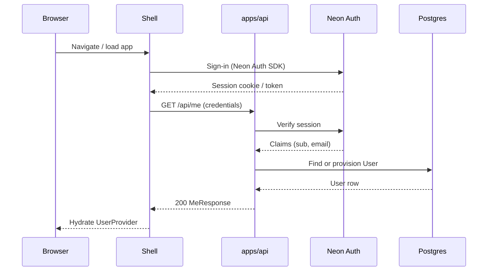

# API Application — Architecture

## System context

```txt
                    ┌──────────────────────────────────────────┐
                    │  apps/shell (:5173)                       │
                    │  Neon Auth client, UserProvider, fetch API│
                    └───────────────┬──────────────────────────┘
                                    │ credentials + JSON
                                    ▼
                    ┌──────────────────────────────────────────┐
                    │  apps/api (:3001)                         │
                    │  middleware → routes → services → repos   │
                    └───────┬──────────────────────┬───────────┘
                            │                      │
                            ▼                      ▼
                    Neon Auth                 Neon Postgres
                    (JWT / session)           (Prisma @repo/database)
```

Micro-frontends (`mfe-products`, `mfe-cart`) are **not** in the request path for API v1.

## Request flow (happy path)



## Request flow (layers)

```txt
HTTP Request
    │
    ▼
┌─────────────────────────────────────┐
│  config/          env, app constants │
└─────────────────────────────────────┘
    │
    ▼
┌─────────────────────────────────────┐
│  middleware/      request-id, cors,   │
│                   security headers,   │
│                   auth, error wrapper │
└─────────────────────────────────────┘
    │
    ▼
┌─────────────────────────────────────┐
│  routes/          mount paths, wire   │
│                   middleware chains   │
└─────────────────────────────────────┘
    │
    ▼
┌─────────────────────────────────────┐
│  controllers/     parse input, call   │
│                   service, map HTTP   │
│                   status + body       │
└─────────────────────────────────────┘
    │
    ▼
┌─────────────────────────────────────┐
│  services/        business rules,     │
│                   authorization,      │
│                   orchestration       │
└─────────────────────────────────────┘
    │
    ▼
┌─────────────────────────────────────┐
│  repositories/    Prisma queries,     │
│                   mapping to domain   │
└─────────────────────────────────────┘
    │
    ▼
┌─────────────────────────────────────┐
│  db/              client export,      │
│                   transaction helper  │
└─────────────────────────────────────┘
```

## Layer responsibilities

### `src/config/`

- Load and validate environment variables (Zod).
- Export singletons: `env`, `corsOptions`, `authConfig`, logger level.
- Fail fast at process start if required secrets missing in production.

### `src/middleware/`

| Middleware | Responsibility |
|------------|----------------|
| `request-id` | Propagate `X-Request-Id` for logs and error payloads |
| `cors` | Allow shell origins; credentials mode |
| `security-headers` | HSTS (prod), `X-Content-Type-Options`, etc. |
| `auth` | Verify Neon Auth session; populate `req.context.user` |
| `require-auth` | Route-level guard; 401 if no context |
| `error-handler` | Catch thrown `AppError`; map to JSON; log stack in dev only |
| `rate-limit` | Optional v1 stub for write routes |

### `src/routes/`

- Compose routers: `health.routes.ts`, `me.routes.ts`, `users.routes.ts`.
- No business logic—only HTTP method, path, middleware stack, controller binding.
- Register under `/health` and `/api` (version prefix when OD-2 resolved).

### `src/controllers/`

- Extract validated input from request (query/params/body).
- Invoke one service method per handler.
- Return typed response DTOs; never import Prisma directly.

### `src/services/`

- **Auth context usage:** compare `authUserId` to resource owner.
- **UserService:** `getMe`, `getUserById`, `ensureUserProfile`.
- Throw domain errors (`NotFoundError`, `ForbiddenError`) converted by error middleware.
- Future: `AiService`, `CatalogService` without changing route mounting pattern.

### `src/repositories/`

- Encapsulate Prisma calls for `User` model (extend per domain).
- Accept optional transaction client for composable units of work.
- Map Prisma records → domain types in `src/types/`.

### `src/db/`

- Re-export `database` from `@repo/database` or thin wrapper for test doubles.
- `withTransaction(fn)` helper per [database-strategy.md](./database-strategy.md).

### `src/types/`

- API-local domain types; re-export shared DTOs from `@repo/types` where applicable.
- `AuthenticatedContext`, `AppError` codes.

### `src/utils/`

- Pure helpers: pagination, id parsing, response builders.
- No I/O.

### `tests/`

- Mirror `src/` structure: `unit/`, `integration/`, `contract/`.
- See [testing-plan.md](./testing-plan.md).

## Error handling architecture

```txt
Service throws AppError { code, status, message }
        │
        ▼
error-handler middleware
        │
        ├── 4xx → client JSON { error: { code, message, requestId } }
        ├── 5xx → generic message in prod; details in dev
        └── log structured line (level by status)
```

Unexpected errors → `500` + `INTERNAL_ERROR` code; never expose stack in production responses.

## Deployment unit

- **Single deployable:** `apps/api` Node/Bun process.
- **Build:** `tsc` or `tsup` bundle to `dist/`; run `node dist/main.js` or `bun run src/main.ts`.
- **Not** embedded in Vite shell build.
- **Turbo:** add `api#dev`, `api#build`, `api#test` pipeline tasks when implemented.

## Integration with monorepo

| Consumer | Integration |
|----------|-------------|
| Shell | `VITE_API_BASE_URL` → `fetch` or generated client |
| CI | `turbo run test --filter=api`; migrate DB before integration tests |
| Packages | API depends on `@repo/database`, `@repo/types`, auth helpers |

## Evolution paths

1. **RBAC** — `src/services/authorization/` + role claims on context (see auth-strategy).
2. **BFF aggregation** — shell calls single `/api/dashboard` composed in a service.
3. **AI routes** — `routes/ai.routes.ts` + provider adapter in `services/ai/`.
4. **Public read APIs** — separate middleware chain without `require-auth` but with API keys or CDN cache headers.
