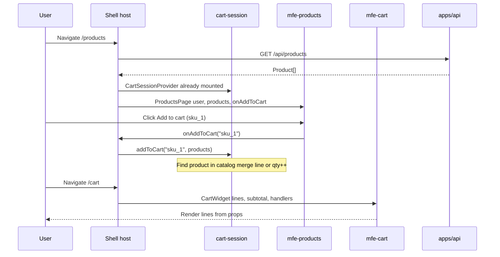
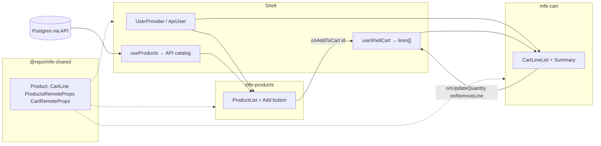

# Cart flow — Architecture (phase 1)

How **cross-MFE add to cart** works in this repo: shell-owned cart state, props and callbacks to federated remotes, no direct remote-to-remote coupling.

**Implementation:** [phase-1-cross-mfe.md](./phase-1-cross-mfe.md) · **Later persistence:** [phase-2-persisted-api.md](./phase-2-persisted-api.md)

---

## Big picture

```txt
┌─────────────────────────────────────────────────────────────────────────┐
│  apps/shell (host) :5173                                                │
│  React Router · Neon Auth · GET /api/me · GET /api/products             │
│                                                                         │
│  ┌─────────────────────────────────────────────────────────────────┐    │
│  │  CartSessionProvider  ←── single source of cart truth (memory)  │    │
│  │  lines[], subtotal, addToCart(), updateQuantity(), removeLine() │    │
│  └─────────────────────────────────────────────────────────────────┘    │
│         │ props/callbacks                    │ props/callbacks          │
│         ▼                                    ▼                          │
│  /products route                      /cart route                       │
│  federated ProductsPage               federated CartWidget              │
└─────────┬────────────────────────────────────┬──────────────────────────┘
          │ Module Federation                  │
          ▼                                    ▼
   mfe_products :5174                   mfe_cart :5175
   (catalog UI only)                    (cart UI only)
   NO cart state                        NO product API
   NO import of mfe_cart                NO import of mfe_products
```

**Rule:** Remotes never talk to each other. The shell owns cart state and passes **data + callbacks** down.

---

## Runtime flow (add to cart)



---

## State ownership



| Data | Owner | Persisted? |
|------|--------|------------|
| Products | API → shell fetch → prop | Yes (DB, spec **12**) |
| User session | Neon + `GET /api/me` → shell | Cookie (spec **07**) |
| **Cart lines** | **Shell `cart-session`** | **No** in phase 1 (refresh clears) |

---

## Same session on `/products` and `/cart`

```txt
app.tsx
 └── ApiUserProvider
      └── CartSessionProvider     ◄── one React state tree for cart
           └── BrowserRouter
                └── ShellLayout
                     ├── /products  → ProductsRoutePage
                     │                    ├─ useProducts() → API
                     │                    ├─ useCartSession().addToCart
                     │                    └─ ProductsPage
                     │                         products={...}
                     │                         onAddToCart={(id) => add(id, products)}
                     │
                     └── /cart      → CartRoutePage
                                          ├─ useCartSession() → lines, handlers
                                          └─ CartWidget
                                               lines, subtotal, onUpdateQuantity, onRemoveLine
```

Navigating **Products → Cart** does not unmount `CartSessionProvider`, so lines added on `/products` still appear on `/cart`.

**Key files:**

| Layer | Path |
|-------|------|
| Provider | `apps/shell/src/features/cart-session/components/cart-session-provider.tsx` |
| State | `apps/shell/src/features/cart-session/hooks/use-shell-cart.ts` |
| Products route | `apps/shell/src/features/products-route/components/products-route-page.tsx` |
| Cart route | `apps/shell/src/features/cart-route/components/cart-route-page.tsx` |
| Shared types | `packages/mfe-shared/src/types.ts` |

---

## Remote responsibilities

```txt
mfe-products                          mfe-cart
─────────────                         ─────────
✓ Render catalog                      ✓ Render line items
✓ Call onAddToCart(productId)         ✓ Call host qty/remove callbacks
✗ Hold cart state                     ✗ Fetch products
✗ Call mfe_cart                       ✗ Call API
✗ import cart remote                  ✗ import products remote
```

**Standalone dev** (`bun dev` inside a remote): each app supplies stub props — products omit add when no callback; cart uses `StandaloneCartApp` + local `useCart` for interactive demo without the shell.

---

## Duplicate add (merge by productId)

```txt
cart-session lines: []

User adds sku_1 (Trail Runner Pack, $89)
  → [{ id: sku_1, productId: sku_1, quantity: 1, name, price }]

User adds sku_1 again
  → same line, quantity: 2   (not a second row)

User opens /cart
  → CartWidget shows 2 × $89 → subtotal $178
```

Line `id` equals `productId` in phase 1 (see [phase-1-cross-mfe.md](./phase-1-cross-mfe.md) decision P1-5).

---

## Phase 2 (planned) — same remote contract

```txt
Phase 1 (implemented):
  mfe-products ──onAddToCart──► shell memory ──props──► mfe-cart

Phase 2 (draft):
  mfe-products ──onAddToCart──► shell ──POST/PATCH/DELETE /api/cart/*──► Postgres
                                    │◄── GET /api/cart ─────────────────┘
                                    └── same CartRemoteProps to mfe-cart
```

Phase 2 changes **shell `cart-session` internals only**, not `ProductsRemoteProps` / `CartRemoteProps`. Detail: [phase-2-persisted-api.md](./phase-2-persisted-api.md).

---

## Manual verification

With `bun run dev` from repo root:

1. Sign in (Neon) if `/products` and `/cart` are behind `AuthRequired`.
2. Open `/products` → **Add to cart** on a product.
3. Open `/cart` → line appears with correct name, price, quantity.
4. Add the same product again on `/products` → quantity increments on `/cart`.
5. Optional failure demo: stop `mfe-cart` dev server, visit `/cart` — shell fallback still works.

---

## Interview talking point

> Catalog and checkout are separate deployable teams. The **host** owns session and cart truth; remotes are presentational and communicate only through typed props from `@repo/mfe-shared` — not shared mutable stores imported across federation boundaries.

Related: [architecture.md](../../architecture.md), [interview-guide.md](../../interview-guide.md#cross-mfe-cart-shell-orchestration).
