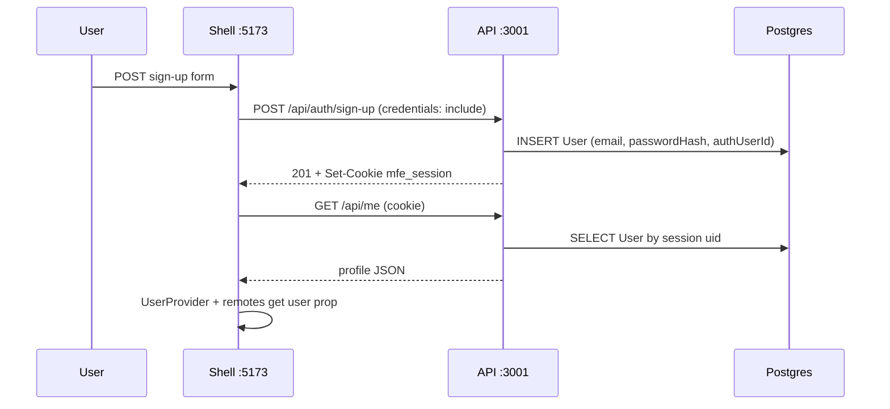

# Shell + API auth flow

*How sign-up, sign-in, sign-out, and session loading work in this MFE repo.*

---

## The one-liner

**The shell owns auth UX.** Users register and sign in against **`apps/api`** with email and password. The API creates a **Prisma `User` row** and sets an **`mfe_session` HttpOnly cookie**. On every load, the shell calls **`GET /api/me`** with `credentials: "include"`; when that succeeds, it puts the profile in React context and passes a read-only **`user`** prop into product and cart remotes. Remotes never call auth endpoints.

---

## Who owns what

| Layer | Responsibility |
|--------|----------------|
| **Shell** (`apps/shell`) | Routes `/sign-in`, `/sign-up`; forms; header nav; `ApiUserProvider`; route guard for `/products` and `/cart` |
| **API** (`apps/api`) | `POST /api/auth/sign-up`, `sign-in`, `sign-out`; `GET /api/me`; session cookie; password hashing; Prisma `User` |
| **Remotes** (`mfe-products`, `mfe-cart`) | Receive `user` from shell props only — no sign-in UI, no `/api/me` |
| **`@repo/neon-auth`** | Optional **server** fallback on the API (`verifySession` for Neon or `DEV_AUTH_*`) — not used by the shell UI anymore |

---

## End-to-end flow



### Sign-up

1. User opens `/sign-up` and submits email + password (≥ 8 chars), optional name.
2. Shell `AuthCredentialsForm` → `signUp()` in `auth-api-client.ts` → `POST /api/auth/sign-up`.
3. API validates body, checks email uniqueness, hashes password (`scrypt`), inserts `User` with `authUserId` like `local:<uuid>`.
4. API sets **`mfe_session`** cookie (signed payload: user id + expiry).
5. Shell calls `reloadUser()` then navigates to `?from=` return path (default `/`).

### Sign-in

Same as sign-up, but `POST /api/auth/sign-in` verifies email + `passwordHash` before setting the cookie.

### Sign-out

1. Header **Sign out** → `POST /api/auth/sign-out` (clears cookie) → `reloadUser()`.
2. `GET /api/me` returns **401** → shell state `unauthenticated`.

### App bootstrap (every page load)

1. `App` wraps the tree in **`ApiUserProvider`**.
2. On mount, `fetchMe()` → `GET /api/me` with `credentials: "include"`.
3. **200** → map API user to `@repo/mfe-shared` `User`, wrap children in **`UserProvider`**.
4. **401** → `unauthenticated` (guest); public routes still render.
5. **Other errors** → `error` with retry in nav / `AuthRequired`.

Protected routes (`/products`, `/cart`) use **`AuthRequired`**: unauthenticated users redirect to `/sign-in?from=<current path>`.

---

## API session details

- **Cookie name:** `mfe_session`
- **Signing:** HMAC-SHA256 over a base64url JSON payload `{ uid, exp }` using `SESSION_SECRET` (dev default when `NODE_ENV` is `development` or `test`).
- **Verification order** in `get-request-user.ts`:
  1. API cookie → load Prisma user by `id`
  2. Else `@repo/neon-auth` `verifySession` (Neon `get-session` or `DEV_AUTH_USER_ID` / `DEV_AUTH_EMAIL`)

`GET /api/me` runs `authMiddleware` then **`ensureUserProfile`** — for API sign-up the row already exists; for Neon/dev fallback it may create or update the row on first successful auth.

---

## Shell file map

```
apps/shell/src/
  app.tsx                          # ApiUserProvider, routes, AuthRequired on products/cart
  features/auth/
    components/
      api-user-provider.tsx        # Session bootstrap + UserProvider
      auth-credentials-form.tsx    # Shared sign-in / sign-up form
      sign-in-page.tsx / sign-up-page.tsx
      auth-page-gate.tsx           # Redirect if already signed in
      auth-nav.tsx                 # Sign in / Create account / Sign out
      auth-required.tsx            # Redirect guests off protected routes
    context/auth-session-context.tsx
    lib/
      auth-api-client.ts           # POST sign-up | sign-in | sign-out
      api-client.ts                # GET /api/me
      map-api-user.ts              # API shape → Mfe User
```

---

## API file map

```
apps/api/src/
  routes/auth.ts                   # Public sign-up, sign-in, sign-out
  routes/me.ts                     # GET /api/me (authenticated)
  lib/
    api-session.ts                 # Cookie create / verify / clear
    password.ts                    # scrypt hash + verify
    users.ts                       # createUserWithPassword, ensureUserProfile
    get-request-user.ts            # Cookie first, then Neon/dev
  middleware/auth.ts               # Attaches req.user from getRequestUser
```

---

## Environment

| App | Variable | Purpose |
|-----|----------|---------|
| Shell | `VITE_API_BASE_URL` | API origin (default `http://localhost:3001`) |
| API | `CORS_ORIGIN` | Must match shell origin; `credentials: true` on CORS |
| API | `SESSION_SECRET` | Cookie signing (required in production; dev has a default) |
| API | `DATABASE_URL` | Prisma / Postgres (`packages/database`) |
| API (optional) | `DEV_AUTH_*` | Auto-login for API-only demos without forms |
| API (optional) | `NEON_AUTH_*` | Legacy Neon session verify on `/api/me` |

Shell does **not** need `VITE_NEON_AUTH_URL`.

---

## Data model

One app user table — **`User`** in Prisma:

- `email`, `passwordHash` (API accounts)
- `authUserId` (stable external id; API uses `local:<uuid>`)
- `name`, `role`, timestamps

Sign-up writes the row immediately. There is no separate “Neon user vs app user” path in the default shell flow.

---

## Interview talking points

1. **Why cookie on the API, not localStorage JWT in the shell?** HttpOnly cookie reduces XSS token theft; shell and API are different origins in dev but CORS allows credentialed requests when `CORS_ORIGIN` is set.
2. **Why `/api/me` after sign-up?** Single source of truth for “who is logged in” and the same shape remotes consume (via mapped `User`).
3. **Why shell-only auth UI?** One login surface; remotes stay dumb and testable with a mocked `user` prop.
4. **What if `/api/me` fails after sign-up?** Check Network: cookie on `:3001`, `SESSION_SECRET`, DB migration (`User.passwordHash`), and `VITE_API_BASE_URL`.

---

## Related specs

- [07-shell-auth.md](../feature-specs/07-shell-auth.md)
- [07-auth-e2e-gate.md](../feature-specs/07-auth-e2e-gate.md)
- [02-api-application/auth-strategy.md](../feature-specs/02-api-application/auth-strategy.md)
